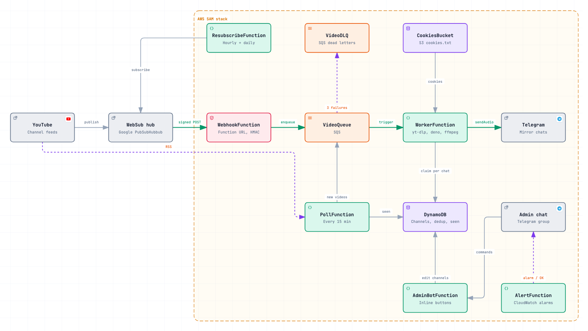
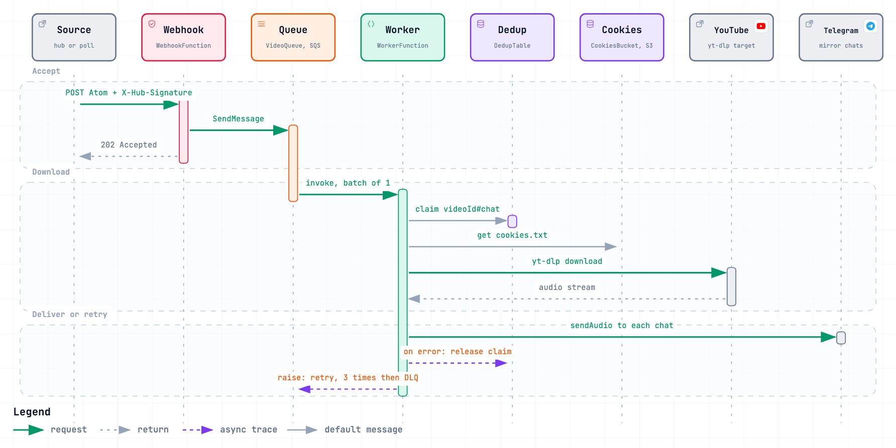
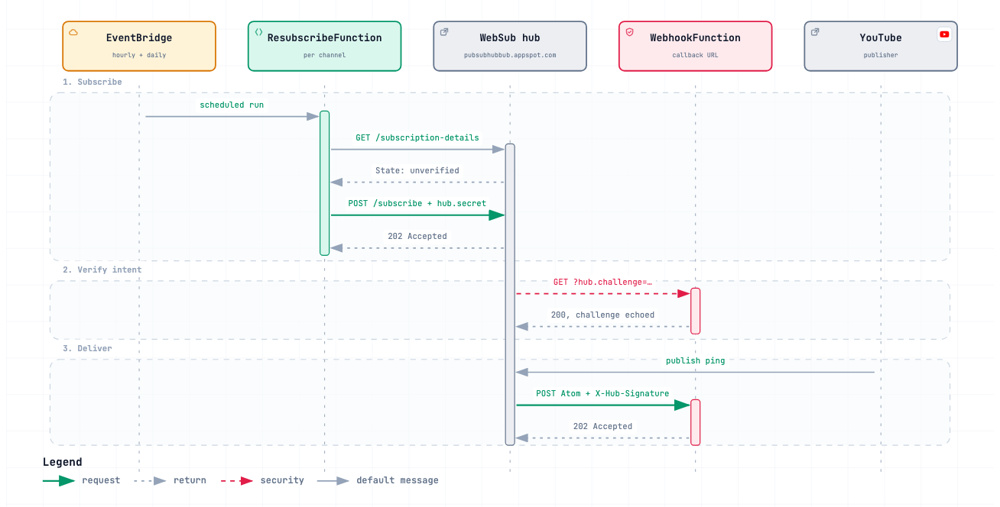

# autouploadbot

A serverless bot that watches YouTube channels and reposts every new upload
to a Telegram channel as an MP3 with cover art, artist and title, captioned
with an "Original upload" link back to the video.

It runs entirely on AWS Lambda and costs cents per month: the only paid
line items are ECR image storage and a few DynamoDB reads.

<picture>
  <source media="(prefers-color-scheme: dark)" srcset="docs/images/architecture-dark.png">
  
</picture>

## How it works

New videos arrive through **two independent paths**, and both end up in the
same SQS queue:

| Path | Trigger | Latency | Depends on |
| --- | --- | --- | --- |
| **Push** | the WebSub hub POSTs a signed Atom entry to `WebhookFunction` | seconds | a verified hub subscription |
| **Poll** | `PollFunction` reads each channel's RSS feed every 15 minutes | up to 15 min | nothing but YouTube |

Both paths produce identical messages. If a video arrives through both,
`WorkerFunction` claims its `videoId` in DynamoDB first, so it reaches the
channel exactly once. The same claim protects against YouTube re-sending a
notification when a title is edited, and against SQS at-least-once delivery.

The worker downloads the audio with `yt-dlp`, converts it to MP3 with
`ffmpeg` and sends it through the Telegram Bot API with an "Original upload"
link to the video in the caption. A failed attempt releases
its claim and raises, so SQS retries it; after three failed receives the
message moves to `VideoDLQ` instead of disappearing.

<picture>
  <source media="(prefers-color-scheme: dark)" srcset="docs/images/video-pipeline-dark.png">
  
</picture>

### Why every piece is there

- **The webhook only enqueues.** Lambda freezes an instance as soon as it
  returns, so work cannot continue in a background thread after the `202`.
  All downloading happens inside the worker's own invocation.
- **The webhook is a zip on the standard library**, while the worker is a
  container. The webhook has to answer the hub's verification quickly, so it
  cold-starts in a fraction of a second; the worker needs `ffmpeg` and `deno`,
  so it ships as a 960 MB image and a ~10 s cold start that nobody waits on.
- **Worker concurrency is capped on the SQS event source**
  (`MaximumConcurrency`), not with reserved concurrency: new AWS accounts
  have a Lambda concurrency limit of 10, which reserved concurrency cannot
  carve up.
- **`/tmp` on Lambda is real ephemeral disk** (4 GB here) and does not eat
  into the function's memory, so long mixes fit without a bigger instance.

## Repository layout

```
functions/ingest/        zip, stdlib only
  app.py                   WebhookFunction: hub verification, HMAC check, enqueue
  poll.py                  PollFunction: RSS polling with backlog protection
  xml_parser.py            Atom parsing and "Artist — Track" title parsing
functions/resubscribe/   zip, stdlib only
  app.py                   ResubscribeFunction: WebSub subscribe and renew
worker/                  container image (yt-dlp, deno, ffmpeg)
  Dockerfile
  app/handler.py           WorkerFunction entry point
  app/downloader.py        yt-dlp download, cookies from S3
  app/telegram.py          sendAudio via aiogram
  app/dedup.py             DynamoDB claim / release
tools/
  send_test_event.py       sign and send a fake hub notification
  curl_to_cookies.py       turn DevTools cookies into cookies.txt
docs/diagrams/           archify sources (.json) and interactive diagrams (.html)
template.yaml            the whole stack: 2 queues, 2 tables, a bucket, 4 functions, IAM
samconfig.toml.example   deploy parameters to copy
```

## Deploy

### Prerequisites

- AWS CLI with credentials — preferably an IAM user, not the root account
- [AWS SAM CLI](https://docs.aws.amazon.com/serverless-application-model/latest/developerguide/install-sam-cli.html)
- Docker, running: `sam build` builds the worker image locally
- A Telegram bot that is an admin of the target channel

### 1. Secrets

Both live in SSM Parameter Store; the template only knows their names.
Standard parameters are free.

```bash
aws ssm put-parameter --name /autouploadbot/bot-token \
  --type SecureString --value 'TELEGRAM_BOT_TOKEN'

aws ssm put-parameter --name /autouploadbot/hub-secret \
  --type SecureString --value "$(openssl rand -hex 32)"
```

`hub-secret` is shared with the WebSub hub, which signs every notification
with it. The webhook's Function URL is public by necessity — the hub cannot
authenticate to AWS — and rejects anything without a valid
`X-Hub-Signature` with `403`.

### 2. Parameters

```bash
cp samconfig.toml.example samconfig.toml
```

| Parameter | Meaning |
| --- | --- |
| `TargetChatId` | Telegram chat to post to. Channels and supergroups start with `-100`: `-1001234567890`. Without the minus Telegram answers `chat not found`. |
| `ChannelIds` | YouTube channel IDs, comma-separated, no spaces: `UCxxx…,UCyyy…`. The template rejects anything that is not `UC` + 22 characters. |
| `LeaseSeconds` | WebSub lease, default and maximum `432000` (5 days). |
| `WorkerConcurrency` | How many tracks download in parallel, default `5`, minimum `2`. |
| `BotTokenParam`, `HubSecretParam` | SSM parameter names, defaults as above. |

### 3. Build and deploy

```bash
sam build
sam deploy
```

On the first deploy SAM warns that `WebhookFunction` has no authentication —
answer `y`, that is intended.

### 4. First run

```bash
STACK=autouploadbot   # your stack_name
out() { aws cloudformation describe-stacks --stack-name "$STACK" \
  --query "Stacks[0].Outputs[?OutputKey=='$1'].OutputValue" --output text; }

# subscribe right away instead of waiting for the hourly schedule
aws lambda invoke --function-name "$(out ResubscribeFunctionName)" /dev/stdout
```

The first `PollFunction` run (within 15 minutes) posts nothing: it marks the
15 videos already in each feed as seen, otherwise the whole back catalogue
would land in the channel. A channel added to `ChannelIds` later is handled
the same way.

## Adding a channel

Append its ID to `ChannelIds` in `samconfig.toml`, then `sam build && sam deploy`.
Callback, queue and deduplication are shared by all channels.

An ID looks like `UC` followed by 22 characters. For a `youtube.com/@handle`
link it is in the page source:

```bash
curl -s https://www.youtube.com/@handle | grep -o '"externalId":"UC[^"]*"'
```

Check that the ID really is that channel by opening
`https://www.youtube.com/feeds/videos.xml?channel_id=UC…` and looking at
`<author>`: channel pages embed other channels' IDs too.

## Titles

The worker needs an artist and a track name. Titles are split on the first of
` — `, ` – `, ` - ` (em dash, en dash, hyphen — each with spaces around), in
that order, so `Artist — Track - Extended Mix` keeps the hyphen inside the
track name. A trailing `[CATALOG123]` is removed. Videos with none of these
separators are skipped with a log line.

## YouTube from a datacenter IP

Out of the box YouTube answers requests from AWS with
`Sign in to confirm you're not a bot`. It takes two things to get through, and
you need both:

1. **A JavaScript runtime and the signature solver.** The image ships `deno`,
   and the dependency is `yt-dlp[default]`, which pulls in `yt-dlp-ejs`.
   Without the solver `deno` is useless: signatures are not solved and yt-dlp
   fails with `Requested format is not available`.
2. **Cookies of a logged-in account** in `CookiesBucket`. The worker copies
   them to `/tmp` on every cold start.

Use a separate account, not your main one: regular downloads from a datacenter
IP with its cookies can get it blocked.

Export the cookies from a **private (incognito) window**, not from your normal
browser session: the browser keeps rotating the cookies of a session in use,
and an exported copy of such a session dies within the hour. Log in, open any
video, then DevTools → Application → Cookies → `https://www.youtube.com`,
select all rows and copy. Close the window without logging out — logging out
invalidates the session — and do not use that session again.

Then **type** (do not copy-paste — that would overwrite the cookies in the
clipboard):

```bash
tools/upload_cookies.sh
```

It converts the clipboard with `tools/curl_to_cookies.py`, uploads the result
to `CookiesBucket` of the stack named in `samconfig.toml` and deletes the local
copy. The converter accepts rows from Application → Cookies, "Copy as cURL"
from the Network tab or a bare `Cookie` header value, never prints cookie
values, and refuses anything without signs of a logged-in session — so a
clipboard holding something else stops the upload instead of replacing good
cookies with junk.

When cookies expire, downloads fail with `Sign in to confirm you're not a bot`
and the videos pile up in `VideoDLQ`. Upload fresh cookies, then move the
failed videos back:

```bash
aws sqs start-message-move-task --source-arn \
  "$(aws sqs get-queue-attributes --queue-url "$(out DeadLetterQueueUrl)" \
     --attribute-names QueueArn --query Attributes.QueueArn --output text)"
```

Deduplication skips anything that already reached the channel. Messages stay
in the DLQ for 14 days, counted from when the video was first queued.

## WebSub subscription

<picture>
  <source media="(prefers-color-scheme: dark)" srcset="docs/images/websub-handshake-dark.png">
  
</picture>

A subscription becomes active only after the hub verifies it: it sends a
`GET` with a random `hub.challenge` to the callback, and the callback must echo
it back. Until then the hub keeps the request as `unverified` and delivers
nothing. The check exists so nobody can subscribe someone else's URL to a
stream of notifications.

`ResubscribeFunction` runs on two schedules:

| Schedule | Payload | What it does |
| --- | --- | --- |
| `Retry`, hourly | `{"force": false}` | re-submits subscriptions that are not `verified` yet |
| `Renew`, daily | `{"force": true}` | renews every lease regardless of state |

Channels are processed in parallel: the hub can hold each request for ~20 s.
A `5xx` or timeout from the hub is logged as "degraded" and does not fail the
run; a `4xx` means our parameters are wrong and does.

Check the state:

```bash
sam logs --stack-name "$STACK" -n ResubscribeFunction | grep 'state='
```

> [!WARNING]
> Since 19 September 2026 `pubsubhubbub.appspot.com` answers every subscribe
> request with `503 Transient error` after ~20 s and never sends the
> verification request, so subscriptions stay `unverified`. The poll path
> covers delivery in the meantime; once the hub recovers, the hourly schedule
> picks the subscriptions up without any action.

Use the real channel feed as the topic,
`https://www.youtube.com/feeds/videos.xml?channel_id=…`. The similar-looking
`/xml/feeds/videos.xml` is a static 463-byte stub that ignores `channel_id`.
The function builds the URL itself, so this only matters when subscribing by
hand.

## Testing without the hub

```bash
python3 tools/send_test_event.py \
  --video 'https://www.youtube.com/watch?v=VIDEO_ID' \
  --title 'Artist — Track'
```

The script signs a fake Atom notification with the same `hub-secret` and posts
it to the webhook, so everything after the hub runs for real: signature check,
queue, worker, YouTube, Telegram. The track is actually posted. Running it
again for the same video does nothing — deduplication skips it. The stack name
defaults to `stack_name` from `samconfig.toml`.

## Operations

```bash
sam logs --stack-name "$STACK" --tail                   # all functions
sam logs --stack-name "$STACK" -n WorkerFunction --tail

aws sqs receive-message --queue-url "$(out DeadLetterQueueUrl)"   # failed videos
```

The console shows the stack under CloudFormation → Stacks, in the region from
`samconfig.toml`. Treat it as read-only: `sam deploy` overwrites manual changes.

Every worker deploy adds an image to ECR. Keep only the last two:

```bash
aws ecr put-lifecycle-policy --repository-name <repo> --lifecycle-policy-text \
  '{"rules":[{"rulePriority":1,"description":"keep last 2","selection":{"tagStatus":"any","countType":"imageCountMoreThan","countNumber":2},"action":{"type":"expire"}}]}'
```

## Cost

For four channels and ~150 tracks a month:

| Service | Usage | Cost |
| --- | --- | --- |
| Lambda | ~20k GB-s, ~4k invocations; free tier is 400k GB-s | $0 |
| ECR | ~1 GB of images | ~$0.10 |
| DynamoDB on-demand | polling reads the seen table, writes only new videos | ~$0.01 |
| SQS, EventBridge Scheduler, S3, SSM, data out | well inside free tiers | $0 |

A track costs about 90 GB-s (40–50 s at 2 GB). Peak memory is ~600 MB, so
`MemorySize` could drop to 1024, at the price of slower `ffmpeg` since Lambda
CPU scales with memory.

## Known limitations

- The Telegram Bot API rejects files over 50 MB, so long mixes fail at the send
  step, after downloading and converting.
- A Lambda invocation is capped at 15 minutes per track.
- A deleted video arrives as `<at:deleted-entry>`; the webhook logs
  `Unparseable notification body` and answers `200` so the hub does not retry.
- YouTube cookies expire and have to be re-exported now and then.

## Diagrams

The images above are screenshots of interactive diagrams generated with
[archify](https://github.com/tt-a1i/archify). The interactive versions — pan and
zoom, search, relationship tracing, light and dark themes, exports — are in
`docs/diagrams/*.html`; download one and open it in a browser. The `.json`
files next to them are the sources:

```bash
archify deliver architecture docs/diagrams/architecture.json docs/diagrams/architecture.html --quality showcase
archify deliver sequence docs/diagrams/video-pipeline.json docs/diagrams/video-pipeline.html --quality showcase
archify deliver sequence docs/diagrams/websub-handshake.json docs/diagrams/websub-handshake.html --quality showcase
```
